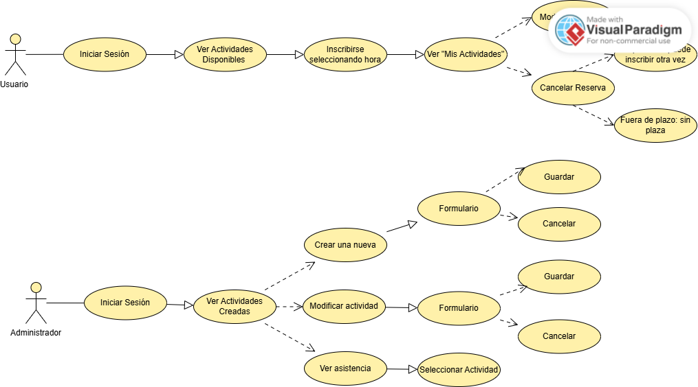

# Aplicación de Escritorio (Vue.js): PetConnect

## Descripción
Aplicación con panel administrativo para la gestión interna del refugio y panel de usuario para las personas incluídas en este público objetivo. El panel administrativo permite el control sobre las actividades y asistencias.

## Características Principales
* Gestor de Actividades: Crear, editar y eliminar eventos.
* Control de Asistencia: Ver personas apuntadas a los eventos y cuales han cancelado fuera de tiempo perdiendo la plaza.
* Creación de nuevos usuario a través de formulario y cerrar la sesión dentro de la applicación.
* Interacción de los Usuarios: inscribirse a eventos, editar la hora y la posibilidad de cancelación.

## Tecnologías
* Framework: Vue 3
* Shell: Electron 
* Base de Datos: MongoDB (Api/Mongoose)
* Estilos: CSS

## Instalación
```bash
npm install 
```
```bash
npm run dev
```
## Caso de Uso: Usuario y Administrador


